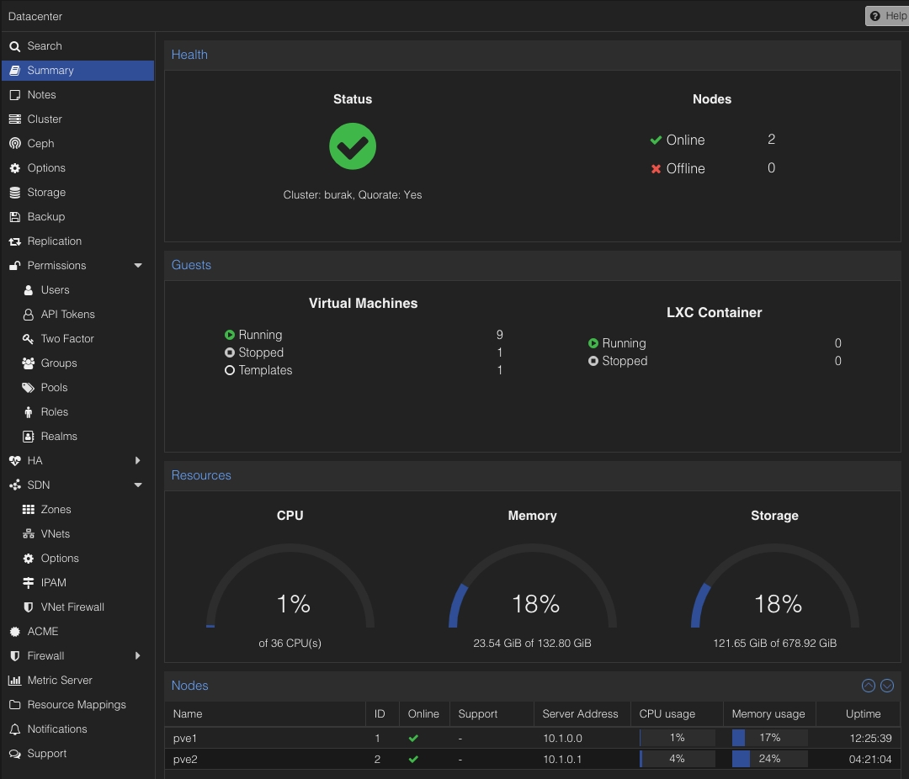
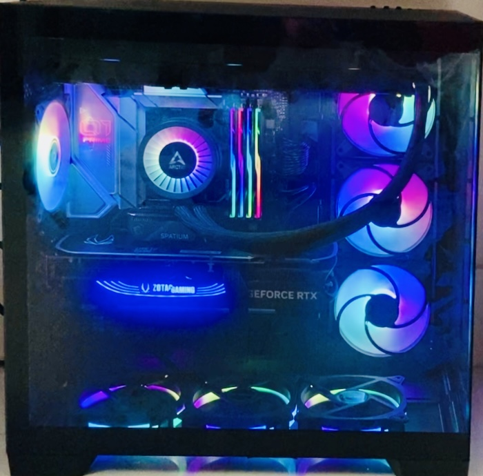

# Proxy's Homelab`

**[Features](#features) • [Get Started](#get-started) • [Documentation](https://homelab.rootproxy.com)**

This project utilizes [Infrastructure as Code](https://en.wikipedia.org/wiki/Infrastructure_as_code) and [GitOps](https://www.weave.works/technologies/gitops) to automate provisioning, operating, and updating self-hosted services in my homelab.
It can be used as a highly customizable framework to build your own homelab.

> **What is a homelab?**
>
> Homelab is a laboratory at home where you can self-host, experiment with new technologies, practice for certifications, and so on.
> For more information, please see the [r/homelab introduction](https://www.reddit.com/r/homelab/wiki/introduction) and the
> [Home Operations Discord community](https://discord.gg/home-operations) (formerly known as [k8s-at-home](https://k8s-at-home.com)).

If you encounter an issue, please create [a bug report](https://github.com/proxyserver2023/ton618/issues/new?template=bug_report.md)
(avoid asking for support about issues specific to this project in other communication channels).

## Overview

Project status: **ALPHA**

This project is still in the experimental stage, and I don't use anything critical on it.
Expect breaking changes that may require a complete redeployment.
A proper upgrade path is planned for the stable release.
More information can be found in [the roadmap](#roadmap) below.

## Demo

## Hardware

### Current Setup

- MultiTasking Home Server (Custom Made):
  - CPU: `32 x AMD Ryzen 9 7950X 16-Core Processor (1 Socket)`
  - RAM: `128 GiB DDR5, 6000MHz`
  - SSD: `PCIe Gen5 2TB`
  - GPU: `ZOTAC GAMING GeForce RTX 4080 SUPER`
- Raspberry Pi 5:
  - CPU: `4 x Cortex-A76 (1 Socket)`
  - RAM: `8 GiB DDR5`
  - SSD: `64 GiB`
- Cudy `GS108 8-Port Gigabit` Desktop Switch
  - Ports: `8`
  - Speed: `1000Mbps`

### Features

- [x] Automated backup and restore
- [ ] Automated Kubernetes installation and management
- [ ] Installing and managing applications using GitOps
- [ ] CI/CD platform
- [ ] Distributed storage
- [ ] Monitoring and alerting
- [ ] Common applications: Gitea, Jellyfin, Paperless...
- [ ] Automated bare metal provisioning with PXE boot
- [ ] Automatic rolling upgrade for OS and Kubernetes
- [ ] Automatically update apps (with approval)
- [ ] Modular architecture, easy to add or remove features/components
- [ ] Automatically update DNS records for exposed services
- [ ] Automated certificate management
- [ ] Expose services to the internet securely with [Cloudflare Tunnel](https://www.cloudflare.com/products/tunnel/)
- [ ] VPN (Tailscale or Wireguard)
- [ ] Private container registry
- [ ] Support multiple environments (dev, prod)
- [ ] Single sign-on
- [ ] Infrastructure testing

### Tech Stack

<table>
    <tr>
        <th>Logo</th>
        <th>Name</th>
        <th>Description</th>
    </tr>
    <tr>
        <td></td>
        <td><a href="https://www.proxmox.com/en/">Proxmox VE</a></td>
        <td>An Open-source server management platform for enterprise virtualization</td>
    </tr>
    <tr>
        <td></td>
        <td><a href="https://www.proxmox.com/en/products/proxmox-backup-server/overview">Proxmox Backup Server</a></td>
        <td>An enterprise backup solution, for backing up and restoring VMs, containers, and physical hosts</td>
    </tr>
    <tr>
        <td></td>
        <td><a href="https://www.truenas.com/">TrueNAS</a></td>
        <td>Provision, Manage and Access your NAS</td>
    </tr>
    <tr>
        <td></td>
        <td><a href="https://www.terraform.io/">Terraform</a></td>
        <td>Automate bare metal provisioning</td>
    </tr>
    <tr>
        <td></td>
        <td><a href="https://www.ansible.com">Ansible</a></td>
        <td>Automate bare metal configuration</td>
    </tr>
    <tr>
        <td></td>
        <td><a href="https://kubernetes.io">Kubernetes</a></td>
        <td>Container-orchestration system, the backbone of this project</td>
    </tr>
    <tr>
        <td></td>
        <td><a href="https://github.com">GitHub Self Hosted Runner</a></td>
        <td>Simple yet powerful CI/CD engine with great extensibility</td>
    </tr>
    <!-- <tr>
        <td></td>
        <td><a href="https://argoproj.github.io/cd">ArgoCD</a></td>
        <td>GitOps tool built to deploy applications to Kubernetes</td>
    </tr> -->
    <!-- <tr>
        <td></td>
        <td><a href="https://cert-manager.io">cert-manager</a></td>
        <td>Cloud native certificate management</td>
    </tr>
    <tr>
        <td></td>
        <td><a href="https://cilium.io">Cilium</a></td>
        <td>eBPF-based Networking, Observability and Security (CNI, LB, Network Policy, etc.)</td>
    </tr>
    <tr>
        <td></td>
        <td><a href="https://www.cloudflare.com">Cloudflare</a></td>
        <td>DNS and Tunnel</td>
    </tr>
    <tr>
        <td></td>
        <td><a href="https://www.docker.com">Docker</a></td>
        <td>Ephemeral PXE server</td>
    </tr>
    <tr>
        <td></td>
        <td><a href="https://github.com/kubernetes-sigs/external-dns">ExternalDNS</a></td>
        <td>Synchronizes exposed Kubernetes Services and Ingresses with DNS providers</td>
    </tr>
    <tr>
        <td></td>
        <td><a href="https://getfedora.org/en/server">Fedora Server</a></td>
        <td>Base OS for Kubernetes nodes</td>
    </tr>
    <tr>
        <td></td>
        <td><a href="https://gitea.com">Gitea</a></td>
        <td>Self-hosted Git service</td>
    </tr>
-->
    <!-- <tr>
        <td></td>
        <td><a href="https://grafana.com">Grafana</a></td>
        <td>Observability platform</td>
    </tr>
    <tr>
        <td></td>
        <td><a href="https://helm.sh">Helm</a></td>
        <td>The package manager for Kubernetes</td>
    </tr> -->
<!--
    <tr>
        <td></td>
        <td><a href="https://k3s.io">K3s</a></td>
        <td>Lightweight distribution of Kubernetes</td>
    </tr>
    <tr>
        <td></td>
        <td><a href="https://kanidm.com">Kanidm</a></td>
        <td>Modern and simple identity management platform</td>
    </tr>
-->
<!--
    <tr>
        <td></td>
        <td><a href="https://grafana.com/oss/loki">Loki</a></td>
        <td>Log aggregation system</td>
    </tr>
    <tr>
        <td></td>
        <td><a href="https://prometheus.io">Prometheus</a></td>
        <td>Systems monitoring and alerting toolkit</td>
    </tr>
    <tr>
        <td></td>
        <td><a href="https://www.nginx.com">NGINX</a></td>
        <td>Kubernetes Ingress Controller</td>
    </tr>
    <tr>
        <td></td>
        <td><a href="https://nixos.org">Nix</a></td>
        <td>Convenient development shell</td>
    </tr>
    <tr>
        <td></td>
        <td><a href="https://ntfy.sh">ntfy</a></td>
        <td>Notification service to send notifications to your phone or desktop</td>
    </tr>
    <tr>
        <td></td>
        <td><a href="https://www.whitesourcesoftware.com/free-developer-tools/renovate">Renovate</a></td>
        <td>Automatically update dependencies</td>
    </tr> -->
    <!-- <tr>
        <td></td>
        <td><a href="https://rook.io">Rook Ceph</a></td>
        <td>Cloud-Native Storage for Kubernetes</td>
    </tr>
    <tr>
        <td></td>
        <td><a href="https://tailscale.com">Tailscale</a></td>
        <td>VPN without port forwarding</td>
    </tr>
    <tr>
        <td></td>
        <td><a href="https://www.wireguard.com">Wireguard</a></td>
        <td>Fast, modern, secure VPN tunnel</td>
    </tr> -->
    <!--
    <tr>
        <td></td>
        <td><a href="https://zotregistry.dev">Zot Registry</a></td>
        <td>Private container registry</td>
    </tr> -->

</table>

## Get Started

- [Try it out locally](./installation/sandbox.md) without any hardware (just 4 commands!)
- [Deploy on real hardware](./installation/production.md) for production workload

## Roadmap

See [roadmap](./roadmap.md) and [open issues](https://github.com/proxyserver2023/ton618/issues) for a list of proposed features and known issues.

## Contributing

Any contributions you make are greatly appreciated.

Please see [contributing guide](./CONTRIBUTE.md) for more information.

## License

Copyright &copy; 2025 - \* ProxyServer2023

Distributed under the GPLv3 License.
See [license page](./LICENSE.md) for more information.

## Acknowledgements

References:

- [Homelab - Khue Doan](https://homelab.khuedoan.com/)

Here is a list of the contributors who have helped to improve this project.
Big shout-out to them!

-  [@proxyserver2023](https://github.com/proxyserver2023)

If you feel you're missing from this list, please feel free to add yourself in a PR.

## Stargazers over time

