# Dark Knight Homelab - Enterprise DevOps & Kubernetes Infrastructure

**[Features](#features) • [Get Started](#get-started) • [Documentation](#documentation) • [Architecture](#architecture) • [Contributing](#contributing)**

[](https://www.gnu.org/licenses/gpl-3.0)
[](https://github.com/amir-parvin-group/dark-knight)
[](https://github.com/amir-parvin-group/dark-knight/issues)
[]()
[]()

**Production-grade homelab infrastructure** featuring high-availability Proxmox clustering, Kubernetes orchestration, and full DevOps automation stack. Built for learning, development, and running production workloads with enterprise-level reliability.

## Primary Use Case

🏠 **Homelab** • 🚀 **DevOps** • ☁️ **Infrastructure** • ⚙️ **Kubernetes**

This project implements [Infrastructure as Code](https://en.wikipedia.org/wiki/Infrastructure_as_code) and [GitOps](https://www.weave.works/technologies/gitops) principles to automate provisioning, operating, and updating self-hosted services in a production-grade homelab environment.

> **What is a homelab?**
>
> Homelab is a laboratory at home where you can self-host, experiment with new technologies, practice for certifications, and so on.
> For more information, please see the [r/homelab introduction](https://www.reddit.com/r/homelab/wiki/introduction) and the
> [Home Operations Discord community](https://discord.gg/home-operations) (formerly known as [k8s-at-home](https://k8s-at-home.com)).

If you encounter an issue, please create [a bug report](https://github.com/amir-parvin-group/dark-knight/issues/new?template=bug_report.md).

## Project Status

🚧 **Status**: Production-Ready Foundation with Active Development

- ✅ **Core Infrastructure**: Proxmox cluster operational
- ✅ **Kubernetes Platform**: HA cluster deployed
- 🔄 **In Progress**: Service mesh, observability, GitOps workflows
- 📅 **Planned**: AI/ML workloads, multi-site replication

See our [detailed roadmap](./roadmap.md) for the complete development timeline.

## Architecture

### Infrastructure Stack

```mermaid
graph TB
    subgraph Physical["Physical Layer"]
        Server["AMD Ryzen 9 Server<br/>128GB RAM | RTX 4080"]
        Pi["Raspberry Pi 5<br/>8GB RAM"]
        Network["Gigabit Network<br/>VLANs Configured"]
    end
    
    subgraph Virtual["Virtualization Layer"]
        Proxmox["Proxmox VE Cluster<br/>HA Configuration"]
        VMs["Ubuntu VMs<br/>Kubernetes Nodes"]
    end
    
    subgraph Orchestration["Container Orchestration"]
        K8s["Kubernetes HA Cluster<br/>3 Masters + Workers"]
        Storage["Longhorn/Ceph<br/>Distributed Storage"]
    end
    
    subgraph Services["Application Layer"]
        DevOps["CI/CD • GitOps<br/>ArgoCD • GitHub Actions"]
        Apps["Production Services<br/>Monitoring • Databases"]
    end
    
    Physical --> Virtual
    Virtual --> Orchestration
    Orchestration --> Services
```



### Current Cluster Status


## Hardware

### Current Hardware Setup


- **Primary Home Server** (Custom Build):
  - CPU: `32 x AMD Ryzen 9 7950X 16-Core Processor (1 Socket)`
  - RAM: `128 GiB DDR5, 6000MHz`
  - SSD: `PCIe Gen5 2TB`
  - GPU: `ZOTAC GAMING GeForce RTX 4080 SUPER`
- **Raspberry Pi 5** (Secondary Node):
  - CPU: `4 x Cortex-A76 (1 Socket)`
  - RAM: `8 GiB DDR5`
  - SSD: `64 GiB`
- **Network Switch**: Cudy GS108 8-Port Gigabit Desktop Switch
  - Ports: `8`
  - Speed: `1000Mbps`

## Features

### ✅ Production Ready
- [x] **High Availability Proxmox Cluster** - Multi-node virtualization with automatic failover
- [x] **Kubernetes HA Deployment** - Production-grade container orchestration
- [x] **Network Segmentation** - VLANs and security policies
- [x] **Infrastructure as Code** - Terraform and Ansible automation
- [x] **Automated Backup & Restore** - Scheduled backups with verification

### 🚧 In Development
- [ ] **GitOps Workflow** - ArgoCD for declarative deployments
- [ ] **Full Observability Stack** - Prometheus, Grafana, Loki, Jaeger
- [ ] **Service Mesh** - Istio/Linkerd for advanced networking
- [ ] **Distributed Storage** - Ceph/Longhorn for persistent volumes
- [ ] **CI/CD Platform** - GitHub Actions self-hosted runners

### 📋 Planned Features
- [ ] **Multi-Site Replication** - Disaster recovery across locations
- [ ] **AI/ML Workloads** - GPU-accelerated computing with CUDA
- [ ] **Zero Trust Security** - Cloudflare Tunnel and mTLS everywhere
- [ ] **Auto-Scaling** - HPA/VPA and cluster autoscaling
- [ ] **Single Sign-On** - Unified authentication with Kanidm/Keycloak

## Tech Stack

<table>
    <tr>
        <th>Logo</th>
        <th>Name</th>
        <th>Description</th>
    </tr>
    <tr>
        <td></td>
        <td><a href="https://www.proxmox.com/en/">Proxmox VE</a></td>
        <td>An Open-source server management platform for enterprise virtualization</td>
    </tr>
    <tr>
        <td></td>
        <td><a href="https://www.proxmox.com/en/products/proxmox-backup-server/overview">Proxmox Backup Server</a></td>
        <td>An enterprise backup solution, for backing up and restoring VMs, containers, and physical hosts</td>
    </tr>
    <tr>
        <td></td>
        <td><a href="https://www.truenas.com/">TrueNAS</a></td>
        <td>Provision, Manage and Access your NAS</td>
    </tr>
    <tr>
        <td></td>
        <td><a href="https://www.terraform.io/">Terraform</a></td>
        <td>Automate bare metal provisioning</td>
    </tr>
    <tr>
        <td></td>
        <td><a href="https://www.ansible.com">Ansible</a></td>
        <td>Automate bare metal configuration</td>
    </tr>
    <tr>
        <td></td>
        <td><a href="https://kubernetes.io">Kubernetes</a></td>
        <td>Container-orchestration system, the backbone of this project</td>
    </tr>
    <tr>
        <td></td>
        <td><a href="https://github.com">GitHub Self Hosted Runner</a></td>
        <td>Simple yet powerful CI/CD engine with great extensibility</td>
    </tr>
    <tr>
        <td></td>
        <td><a href="https://longhorn.io">Longhorn</a></td>
        <td>Cloud-Native Block Storage for Kubernetes</td>
    </tr>
    <tr>
        <td></td>
        <td><a href="https://helm.sh">Helm</a></td>
        <td>The package manager for Kubernetes</td>
    </tr>
    <!--
    <tr>
        <td></td>
        <td><a href="https://argoproj.github.io/cd">ArgoCD</a></td>
        <td>GitOps tool built to deploy applications to Kubernetes</td>
    </tr>
    <tr>
        <td></td>
        <td><a href="https://cert-manager.io">cert-manager</a></td>
        <td>Cloud native certificate management</td>
    </tr>
    <tr>
        <td></td>
        <td><a href="https://cilium.io">Cilium</a></td>
        <td>eBPF-based Networking, Observability and Security (CNI, LB, Network Policy, etc.)</td>
    </tr>
    <tr>
        <td></td>
        <td><a href="https://www.cloudflare.com">Cloudflare</a></td>
        <td>DNS and Tunnel</td>
    </tr>
    <tr>
        <td></td>
        <td><a href="https://www.docker.com">Docker</a></td>
        <td>Ephemeral PXE server</td>
    </tr>
    <tr>
        <td></td>
        <td><a href="https://github.com/kubernetes-sigs/external-dns">ExternalDNS</a></td>
        <td>Synchronizes exposed Kubernetes Services and Ingresses with DNS providers</td>
    </tr>
    <tr>
        <td></td>
        <td><a href="https://getfedora.org/en/server">Fedora Server</a></td>
        <td>Base OS for Kubernetes nodes</td>
    </tr>
    <tr>
        <td></td>
        <td><a href="https://gitea.com">Gitea</a></td>
        <td>Self-hosted Git service</td>
    </tr>
    <tr>
        <td></td>
        <td><a href="https://grafana.com">Grafana</a></td>
        <td>Observability platform</td>
    </tr>
    <tr>
        <td></td>
        <td><a href="https://k3s.io">K3s</a></td>
        <td>Lightweight distribution of Kubernetes</td>
    </tr>
    <tr>
        <td></td>
        <td><a href="https://kanidm.com">Kanidm</a></td>
        <td>Modern and simple identity management platform</td>
    </tr>
    <tr>
        <td></td>
        <td><a href="https://grafana.com/oss/loki">Loki</a></td>
        <td>Log aggregation system</td>
    </tr>
    <tr>
        <td></td>
        <td><a href="https://prometheus.io">Prometheus</a></td>
        <td>Systems monitoring and alerting toolkit</td>
    </tr>
    <tr>
        <td></td>
        <td><a href="https://www.nginx.com">NGINX</a></td>
        <td>Kubernetes Ingress Controller</td>
    </tr>
    <tr>
        <td></td>
        <td><a href="https://nixos.org">Nix</a></td>
        <td>Convenient development shell</td>
    </tr>
    <tr>
        <td></td>
        <td><a href="https://ntfy.sh">ntfy</a></td>
        <td>Notification service to send notifications to your phone or desktop</td>
    </tr>
    <tr>
        <td></td>
        <td><a href="https://www.whitesourcesoftware.com/free-developer-tools/renovate">Renovate</a></td>
        <td>Automatically update dependencies</td>
    </tr>
    <tr>
        <td></td>
        <td><a href="https://rook.io">Rook Ceph</a></td>
        <td>Cloud-Native Storage for Kubernetes</td>
    </tr>
    <tr>
        <td></td>
        <td><a href="https://tailscale.com">Tailscale</a></td>
        <td>VPN without port forwarding</td>
    </tr>
    <tr>
        <td></td>
        <td><a href="https://www.wireguard.com">Wireguard</a></td>
        <td>Fast, modern, secure VPN tunnel</td>
    </tr>
    <tr>
        <td></td>
        <td><a href="https://zotregistry.dev">Zot Registry</a></td>
        <td>Private container registry</td>
    </tr> -->
</table>

## Get Started

### Prerequisites

- **Hardware**: Minimum 32GB RAM, 500GB storage, virtualization support
- **Software**: Proxmox VE 8.x, Ubuntu 22.04 LTS
- **Networking**: Static IPs, VLAN support recommended

### Quick Start

```bash
# Clone the repository
git clone https://github.com/amir-parvin-group/dark-knight.git
cd dark-knight/homelab

# Initialize Terraform
cd terraform
terraform init

# Deploy infrastructure
terraform plan
terraform apply

# Configure with Ansible
cd ../ansible
ansible-playbook -i inventories/hosts/k8s.ini playbooks/k8s/deploy.yaml
```

### Deployment Options

1. **Local Development** - [Sandbox environment](./docs/installation/sandbox.md) for testing
2. **Production Deployment** - [Full production setup](./docs/installation/production.md)
3. **Quick VM Template** - [Automated VM creation](./proxmox/prepare-vm-template.sh)

## Documentation

### 🏗️ Infrastructure Setup
- **[Proxmox Cluster](./docs/proxmox/)** - Virtualization platform deployment
  - [Post-Installation](./docs/proxmox/proxmox-post-installation.md) - Initial configuration
  - [VM Templates](./docs/proxmox/proxmox-vm-template.md) - Automated VM creation
  - [Storage Management](./docs/proxmox/increase-storage.md) - LVM and ZFS configuration

### ⚙️ Kubernetes Platform
- **[Kubernetes Deployment](./docs/k8s.md)** - HA cluster setup and management
- **[Ansible Automation](./ansible/)** - Configuration management
- **[Terraform IaC](./terraform/)** - Infrastructure provisioning

### 🌐 Networking & Storage
- **[Network Architecture](./docs/networking.md)** - VLANs, SDN, and security
- **[TrueNAS Integration](./docs/manage-storage-with-truenas.md)** - Enterprise storage
- **[IP Management](./docs/ips.md)** - Network allocation and planning

### 🚀 DevOps & Services
- **[CI/CD Setup](./docker/gh-self-hosted-runner/)** - GitHub Actions runners
- **[Observability](./observability/)** - Monitoring and alerting
- **[Pi-hole DNS](./docs/pi-hole.md)** - Network-wide ad blocking

### 📚 Guides
- **[Production Deployment](./docs/installation/production.md)** - Full setup guide
- **[Development Environment](./docs/installation/sandbox.md)** - Local testing
- **[Hardware Transition](./docs/macbook-transition.md)** - MacBook upgrade strategy

## Roadmap & Investment Strategy

### Current Phase: Infrastructure Optimization
- Consolidating services on existing hardware
- Implementing cost-effective storage solutions
- Building automation before scaling hardware

### Budget-Conscious Progression
1. **Phase 1** ($500-1000): Storage expansion with consumer NAS
2. **Phase 2** ($1000-2000): Refurbished enterprise servers
3. **Phase 3** ($2000+): Rack infrastructure and 10GbE networking

Full details in [roadmap.md](./roadmap.md) • Track progress via [issues](https://github.com/amir-parvin-group/dark-knight/issues)

## Contributing

Any contributions you make are greatly appreciated.

Please see [contributing guide](./CONTRIBUTE.md) for more information.

## License

Copyright &copy; 2025 - \* ProxyServer2023

Distributed under the GPLv3 License.
See [license page](./LICENSE.md) for more information.

## Acknowledgements

### References & Inspiration

- [Jeff CTO - HomeLab](https://www.youtube.com/@jeffsponaugle6339)
- [Homelab - Khue Doan](https://homelab.khuedoan.com/)

### Contributors

We appreciate all contributions to this project! Special thanks to:

- [@proxyserver2023](https://github.com/proxyserver2023) - Project creator and maintainer

If you've contributed and aren't listed here, please feel free to add yourself in a PR.

## Star History

[](https://star-history.com/#amir-parvin-group/dark-knight&Date)
