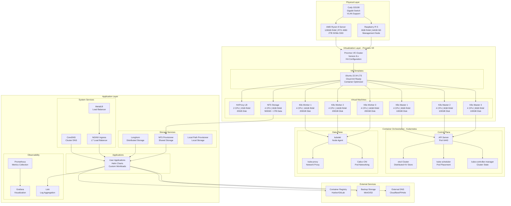
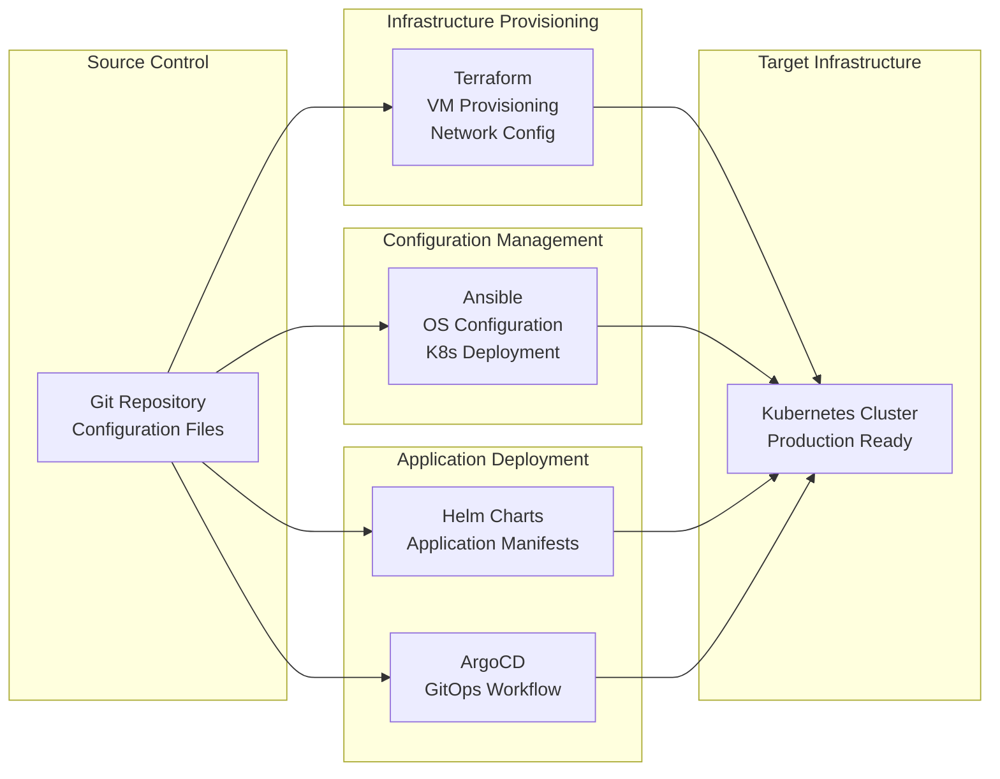

# Architecture Overview

The Dark Knight homelab implements a production-grade, highly available Kubernetes platform built on Proxmox virtualization infrastructure with full automation through Infrastructure as Code principles.

## 🏗️ System Architecture



## 🌐 Network Architecture

### Network Segmentation

| VLAN | Network | Purpose | Services |
|------|---------|---------|----------|
| **Management** | 10.0.0.0/24 | Infrastructure | Proxmox, IPMI, Switches |
| **Kubernetes** | 10.2.0.0/24 | K8s Nodes | Masters, Workers, LB |
| **Storage** | 10.3.0.0/24 | Storage Traffic | NFS, iSCSI, Ceph |
| **DMZ** | 10.4.0.0/24 | External Access | Reverse Proxy, VPN |
| **IoT** | 192.168.50.0/24 | IoT Devices | Smart Home, Sensors |

### IP Allocation Strategy

```bash
# Management Network (10.0.0.0/24)
10.0.0.1        # Gateway/Router
10.0.0.10-20    # Proxmox Hosts
10.0.0.30-40    # Network Equipment
10.0.0.50-99    # Infrastructure Services

# Kubernetes Network (10.2.0.0/24)
10.2.0.1-10     # Load Balancers
10.2.0.11-30    # Master Nodes
10.2.0.31-80    # Worker Nodes
10.2.0.81-99    # Storage Nodes
10.2.0.100-150  # MetalLB Pool
10.2.0.200-254  # DHCP Range

# Pod Network (10.244.0.0/16)
# Calico manages this automatically

# Service Network (10.96.0.0/12)
10.96.0.1       # Kubernetes API
10.96.0.10      # CoreDNS
```

## 🔧 Technology Stack

### Infrastructure Layer
- **Hypervisor**: Proxmox VE 8.x (KVM/QEMU)
- **Operating System**: Ubuntu 22.04 LTS
- **Container Runtime**: containerd 1.7.x
- **Network Plugin**: Calico 3.27.x

### Kubernetes Platform
- **Distribution**: Upstream Kubernetes 1.29.x
- **Init Tool**: kubeadm
- **Service Mesh**: Istio (optional)
- **Package Manager**: Helm 3.x

### Storage Solutions
- **Distributed Storage**: Longhorn 1.6.x
- **Shared Storage**: NFS Subdir External Provisioner
- **Local Storage**: Local Path Provisioner
- **Backup**: Velero + MinIO/S3

### Networking Stack
- **CNI**: Calico (eBPF mode)
- **Load Balancer**: MetalLB (Layer 2)
- **Ingress**: NGINX Ingress Controller
- **Service Mesh**: Istio (for advanced networking)

### Observability Stack
- **Metrics**: Prometheus + Grafana
- **Logging**: Loki + Promtail
- **Tracing**: Jaeger (optional)
- **Alerting**: Alertmanager

## 🚀 Deployment Architecture

### Infrastructure as Code (IaC)


### Deployment Pipeline
1. **Code Commit** → Git repository
2. **Infrastructure** → Terraform provisions VMs
3. **Configuration** → Ansible configures nodes
4. **Platform** → Kubernetes cluster initialization
5. **Applications** → Helm/ArgoCD deployment
6. **Monitoring** → Observability stack activation

## 🔐 Security Architecture

### Defense in Depth
1. **Physical Security**: Secured rack/room access
2. **Network Security**: VLANs, firewalls, VPN access
3. **Infrastructure Security**: Proxmox hardening, SSH keys
4. **Platform Security**: RBAC, Pod Security Standards
5. **Application Security**: Network policies, secrets management

### Authentication & Authorization
- **Infrastructure**: SSH key-based authentication
- **Kubernetes**: RBAC with service accounts
- **Applications**: OIDC integration (optional)
- **Monitoring**: BasicAuth/OAuth2 proxy

### Network Security
- **Firewalls**: iptables/nftables rules
- **Network Policies**: Calico network segmentation
- **TLS**: cert-manager for automatic certificate management
- **VPN**: WireGuard/Tailscale for remote access

## 📊 Resource Planning

### Current Utilization
```bash
# Physical Resources
CPU: 32 cores (AMD Ryzen 9 7950X)
RAM: 128GB DDR5
Storage: 2TB NVMe SSD
Network: Gigabit Ethernet

# VM Allocation
Total VMs: 8
CPU Allocation: 28 vCPU (87.5% of physical)
RAM Allocation: 90GB (70% of physical) 
Storage: 1.2TB (60% of physical)
```

### Scaling Considerations
- **Vertical Scaling**: Add RAM/storage to existing VMs
- **Horizontal Scaling**: Add worker nodes for compute
- **Storage Scaling**: Add Longhorn replicas or NFS capacity
- **Network Scaling**: 10GbE upgrade for high-throughput workloads

## 🔄 High Availability Design

### Control Plane HA
- **etcd**: 3-node cluster for state storage
- **API Server**: 3 instances behind load balancer
- **Scheduler/Controller**: Active-passive with leader election

### Application HA
- **Pod Disruption Budgets**: Ensure service availability
- **Node Affinity**: Spread workloads across nodes
- **Storage Replication**: Longhorn 3-replica setup
- **Ingress**: Multiple NGINX controller instances

### Data Protection
- **Backup Strategy**: Velero for cluster resources
- **Storage Snapshots**: Longhorn/NFS snapshots
- **Configuration Backup**: Git-based IaC backup
- **Disaster Recovery**: Documented restore procedures

## 🔮 Future Expansion Plans

### Phase 2: Enhanced Platform
- **Service Mesh**: Istio for advanced traffic management
- **GitOps**: ArgoCD for declarative deployments
- **Advanced Monitoring**: Jaeger tracing, SLO monitoring
- **Security**: Falco runtime security, OPA policy engine

### Phase 3: Multi-Site Architecture
- **Edge Nodes**: K3s clusters at remote locations
- **WAN Connectivity**: WireGuard mesh networking
- **Data Replication**: Cross-site storage replication
- **Federated Identity**: Centralized authentication

### Phase 4: GPU/AI Workloads
- **GPU Passthrough**: NVIDIA GPU acceleration
- **ML Platform**: Kubeflow/MLflow deployment
- **Model Serving**: Seldon/KServe inference platform
- **Data Pipeline**: Apache Spark on Kubernetes

---
*Architecture version: 2.0 | Last updated: 2025-08-23*